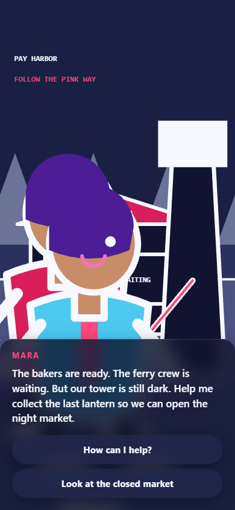
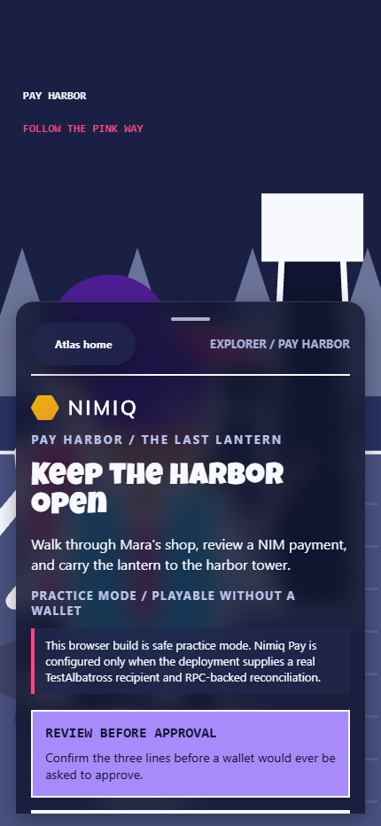
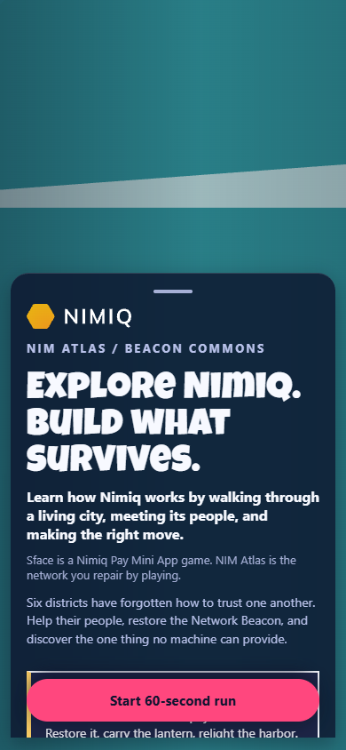
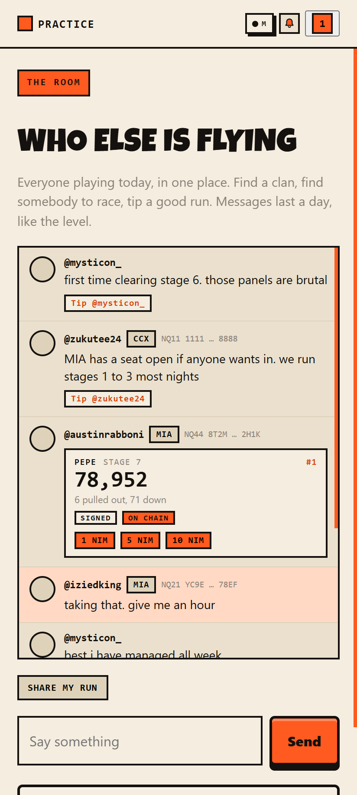
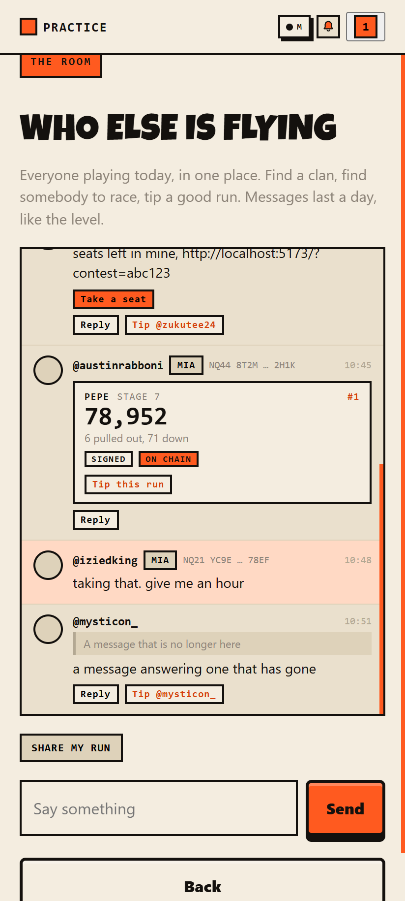

# Sface

**A Nimiq Pay Mini App game. Explore the network. Build what survives.**

Sface is a Nimiq Pay Mini App game where one human character explores NIM Atlas,
helps people through payment and network problems, and sees the world change only
after the right evidence exists.

[Play NIM Atlas](https://sface.site) | [Run it locally](#local-development) |
[Atlas payment safety](#atlas-authority-and-payment-safety)

## Historical Cycle I introduction

<details>
<summary>Open the archived Cycle I introduction</summary>

<div align="center">

# sFace

**Crypto's down. Somebody has to save face.**

sFace is a crypto rescue game where the market and crypto Twitter create the
gameplay. Every day the worst-performing coin in the top 100 becomes the level.
Its real 24-hour price chart is the ground you fly over, the Fear and Greed index
sets the difficulty, and the people trapped in the wreck are the accounts crypto X
spent that day arguing about.

The level is generated from live market data at midnight UTC. Stage 1 to 7 is
never the same mission twice.

[Play](https://sface.site) · [What you are flying](#what-you-are-flying) · [The seven stages](docs/stage-1-to-7.md) · [How it is built](#how-it-is-built) · [Run it](#run-it)

</div>

</details>

---

## Current public experience: NIM Atlas

**Explore the network. Build what survives.**

Sface is a Nimiq Pay Mini App game. NIM Atlas is the free, evergreen adventure
inside it, where each Nimiq idea becomes useful through play. One human
character can switch between two paths:

- **Explorer** walks the districts, visits the Pay Harbor shop, learns the
  Ask, Check, Approve, Confirm, Unlock payment loop, and solves knowledge
  puzzles.
- **Builder** repairs the same systems, predicts provider observations, and
  completes safe, allowlisted trials with copyable TypeScript recipes.

The campaign is local-first and wallet-free by default. The Last Lantern shop
uses an explicit local test fixture, so opening the game never sends NIM and a
transaction hash or wallet callback is never treated as payment proof. Mainnet
shop items, competitive acceptance, rewards, and payouts remain disabled until
their separate owner gates are approved and the exact recipient, network, Luna
amount, and chain-confirmation rules are configured.

Scores, replay verification, wallet binding, prize eligibility, daily puzzles,
Explorer and Builder leaderboards, and the shared Network Beacon are server
responsibilities. Purchased assistance, when eventually enabled, marks a run
assisted and removes it from prize eligibility. The declared launch allocation
is 8,000,000,000 Lunas (80,000 NIM); it is not a claim that funds are present or
that a payout has occurred.

## How to play NIM Atlas

The whole game is one loop: **choose a path → walk to a need → use the Nimiq
idea → see the district change**.

- **Explorer:** use Mara's shop and approve a readable NIM payment.
- **Builder:** repair the provider, exact Luna amount, and confirmation path.
- **Win the scene:** a hash or callback is not enough; the route unlocks only
  after matching canonical confirmation.

### Why the adventure has Nimiq value

| In the game | The Nimiq idea it makes memorable |
| --- | --- |
| Mara's shop | Nimiq Pay asks the person to approve the action. |
| Payment review | NIM is sent as exact integer Lunas to a named recipient on a named network. |
| Harbor unlock | Atlas checks canonical chain evidence before treating the item as paid. |
| Builder repair | A Mini App keeps provider access, user intent, and fulfillment separate. |

These are playable steps, not claims that this build has sent a payment. Read the
official [Nimiq Provider API](https://nimiq.dev/mini-apps/api-reference/nimiq-provider)
and [Nimiq Mini Apps guide](https://nimiq.dev/mini-apps/) for the implementation
behind the lesson.

<div align="center">
  
  
  
  <p><em>Need → check → choose. The in-game How to play page uses the same proof snapshots.</em></p>
</div>

For local development:

```bash
npm install
npm run dev
npm run check
npm run build
npm run prove:relay
npm run archive:legacy:dry
```

For the Release A preview, build first, serve the preview in another terminal,
then measure and capture the real browser surface:

```bash
npm run build
npm run preview -- --host 127.0.0.1 --port 4173
node scripts/measure-atlas.mjs --url http://127.0.0.1:4173 --viewports 320x700,390x844,430x932 --minutes 30
npm run shoot:atlas
npm run verify:atlas:contrast
```

The measurement command reports the requested viewport HTTP timings, built shell
size, compact trace size, replay p95, and a bounded heap sample. It labels those
as local measurements; it does not turn them into deployed-device claims.

`verify:atlas:contrast` walks every screen a player can reach and fails the run
if any text falls below the WCAG AA floor, measuring what the browser actually
painted rather than what the stylesheet declares. It exists because the source
level guards cannot see inherited colour or surfaces stacked translucently over
one another: when the palette was inverted from ink-on-cream to light-on-glass,
eight surfaces became unreadable, two of them at ratios of 1.01 and 1.04, while
every test stayed green. It needs a browser and a served build, so it sits
beside `shoot:atlas` rather than inside `npm run check`.

The live Pay Harbor path is intentionally separate from local play. It requires
a real TestAlbatross recipient configured in the deployment and Nimiq Pay inside
the Nimiq mobile app. The browser never treats a wallet lookup or transaction
hash as payment proof: the server must observe matching canonical evidence before
the lantern can unlock. Until that exact testnet route is owner-approved, the
public browser remains safe practice mode.

The sections below describe archived Cycle I gameplay and screenshots. They are
kept for historical context and are not the current NIM Atlas product surface.

The former Rescue Relay gameplay and records remain in the repository as
historical/internal material. Legacy data in `.data/sface.json` is preserved,
administrator-only, and excluded from Atlas persistence and public navigation.

<div align="center">
  
  <p><em>Every visit opens here. The tap starts the story and unlocks the voice.</em></p>
</div>


## What you are flying

Three things in the game come from real data, and you can check all three from
inside a single run.

| | |
|---|---|
| **The map** | Today's worst performer in the top 100 becomes the stage. Its real 24-hour chart is the ground. A sharp drop is a wall you have to climb. A slow bleed is a long descent with nowhere to stand. |
| **The odds** | Fear and Greed sets how many attackers there are and how fast they fire. Everyone who plays that day gets the same difficulty. |
| **The cast** | The accounts trapped in the wreck are the ones crypto X spent the day discussing, read fresh each morning. Every post the game shows links back to the original. |

One rule holds the third one together: **no statement is ever attributed to a real
person without a link to the post it came from.** An early version generated
plausible quotes and it was removed. The model now returns indices into real posts
and never writes a URL.

<div align="center">
  
  <p><em>Stage one. That ridge is a real price move from the last 24 hours.</em></p>
</div>

## Seven stages, seven different games

Early testers said the stages felt like one run with a different background. Each
one now asks for something different.

| Stage | The world | What it asks |
|---|---|---|
| **1–3** | The chart | Fly it. Free people. Reach the pad before the clock runs out. |
| **4** | The chart, watched | Stay unseen. Guards have sight cones, and crossing one wakes the level. |
| **5** | A city | Drive or walk. The car is twice as fast and heard from twice as far. |
| **6** | A downtown | Read. Four posts that went out today, and one of them explains it. |
| **7** | A ring city | Work it out. No weapon opens a gate. |

**[The stages explained](docs/stage-1-to-7.md)** covers all seven: what each one is
for, what it asks, and the clock and crowding it runs at.

### Stages five and six: the city

Two stages leave the chart behind. A price line drawn as bars already looks like a
skyline, so the streets between the buildings are the gaps between the bars. Same
seed, same numbers, drawn differently. A volatile day gives a jagged city full of
cover. A flat day gives long open avenues with nowhere to hide.

<div align="center">
  
  <p><em>Streets built from the day's price bars. Some buildings open, and the doorway fits a person but not the car.</em></p>
</div>

### Stage seven: the ring city

The finale is a third kind of world. Concentric walls around a core, worked
inward, with one gap in each wall to find.

**No weapon opens a gate.** Reaching a project gives you its intel: where it ranks
by size, and how it is holding up today. The wall then asks a question about the
projects behind it and shows only their tickers, so you can only answer if you
went and looked. Fly past a project and you can still reach the wall. You just
cannot answer it.

<div align="center">
  
  <p><em>Both options marked <code>never asked</code>. The answer was out there and this player did not go and get it.</em></p>
</div>

The projects are the largest by market capitalisation on the day you play, from
the same market call that picks the day's wreck. Nobody curates the list.
Stablecoins are filtered out because a peg is designed not to move, so it has not
survived anything.

## The ending

Clearing the campaign pulls the camera back. The chart you spent seven stages
inside is redrawn smaller and smaller until the crash is a small notch on a long
climb.

<div align="center">
  
  <p><em>Every figure is fetched live. The closing line makes a claim about size, never a forecast.</em></p>
</div>

## Built for Nimiq Pay

sFace is a Mini App. It opens inside the wallet you already have, with your
identity and your clan already there. No download, no extension, no seed phrase in
the middle of a run.

- **Face is rank.** Every run earns it, and rank opens stages, weapons and a
  steadier gun. It adds up across days.
- **Challenges settle wallet to wallet.** Stake a friend on your exact seed and
  the better run takes it.
- **sFace never holds funds.** Stakes are ordinary transactions you sign in Nimiq
  Pay from your own wallet.
- **Scores are signed and re-checked.** Your wallet signs the score. The service
  rebuilds the level from the same seed and refuses a run that could not have
  happened.
- **A run can be written onto the chain.** A real transaction carrying the run,
  with a hash and an explorer entry, that outlives this app.
- **A wallet is also how you get paid.** Somebody who likes your run can tip it
  from the room, straight to the address you proved by signing. Without one there
  is nothing to send to, and the app tells you when somebody tried.

Outside the wallet, every stage is a 25-second preview with the day's real chart
and real cast, and no score at the end.

### Signing a run and writing it on chain are two different things

They both involve your wallet and they are not the same, which caused enough
confusion in testing to be worth stating plainly.

|  | Signing | Writing on chain |
| --- | --- | --- |
| What happens | Your wallet signs a message | Your wallet sends a transaction |
| Costs | Nothing | A network fee |
| Produces | A signature next to your board row | A transaction hash on a public explorer |
| Proves | This run is yours | This run existed, to anyone, forever |
| Survives sFace shutting down | No | Yes |
| Needs NIM | No | Yes |

**Signing** is an Ed25519 signature over the date, the seed, the stage and the
score. It is verified by the service and published beside the row, so a stranger
can check it against your address without trusting us. Nothing is sent anywhere,
so there is no hash to look for and its absence is not a failure.

**Writing on chain** sends an ordinary Nimiq transaction whose data field carries
the same four values. That is what a chain is for: the record exists whether or
not this service does. Every anchored run goes to one address, so a single
explorer page lists every run ever written and every wallet that wrote one.

Only the run on the daily board can be written, because that is the row an anchor
attaches to, and the board keeps your best run of the day.

#### What the service checks, and what it cannot

When the wallet hands back a full serialized transaction, the service takes it
apart and checks five things before recording anything: the signature, the
sender, the recipient, the data, and which chain it is on. Each one is a way to
fake an anchor, and leaving any of them out makes the other four decorative.

When the wallet hands back only a transaction hash, which is what Nimiq Pay does
today, the service records it and says so: the transaction exists, but its
contents have not been seen from here. That is a weaker claim and it is labelled
as one rather than dressed up.

Either way the service has no Nimiq node, so it cannot tell you the transaction
was mined. The explorer settles that.

<div align="center">
  
  &nbsp;&nbsp;
  
  <p><em>Built for phones. Both thumbs, and a guide written for a thumb.</em></p>
</div>

## The room

A leaderboard full of strangers is not a community. Everything social here used
to assume you already knew somebody: a clan is joined by tag, a contest entered
by link, a challenge sent to a friend. That works for people who arrived with
friends and leaves everybody else with a list of names they have no way to
reach.

So there is one shared room, and it is the smallest thing that fixes that.

- **Everyone shows as their X handle**, with their clan beside it. The name,
  picture, clan and wallet are read from the profile when the room is served, so
  nobody can post as somebody else.
- **A clan tag opens that clan.** This is how somebody with no friends here
  finds one that has a seat.
- **Your messages sit on the right, everybody else's on the left.** Which side a
  line is on is the fastest thing to read on a screen full of them.
- **Reply to anybody**, and the answer carries a quote of what it is answering.
  Tap the quote to go to the original.
- **An answer to you is coloured differently** from an answer to somebody else,
  and reads as *You* rather than as your own handle.
- **Fix a typo** in something you said, for fifteen minutes, and the message
  says it was edited for the rest of its life.
- **Post your run** and it draws as a card with the score, the stage, the rank
  and whether it is signed or on chain.
- **Tip a run** in one tap, from the card.
- **Paste a contest link** and it becomes a button that takes a seat.
- **It lasts a day, like the level.** Tomorrow is a different wreck and a
  different conversation.

<div align="center">
  
  <p><em>One page, everyone playing today. Answer somebody, find a clan, take a bet.</em></p>
</div>

A burst from one person reads as one turn: the first line carries the avatar,
name, clan, wallet and time, and the rest are just what they said. Repeating a
masked wallet under every sentence turns a conversation into a list.

Only one thing here gets a colour of its own, and it is a reply **to you**. The
question in a busy room is never "is this a reply", it is "is this a reply to
me", and marking every reply alike answers the wrong one.

You have to have flown a run to speak, which is checked against your profile
rather than asked of your browser. A room anybody can post into without opening
the game fills with people who are not playing it.

**Somebody answering you shows up on the bell**, and that is worked out from the
room rather than stored anywhere: which messages point at one of mine, and did
any land since I last had the room open. Whose message is whose comes from the
service's record of who said what, so nothing can claim to be answering you.

### Links in a message

**No link anybody pastes is ever turned into a link.** Not one, however useful
it looks. This is the only screen in the app that shows what a stranger typed,
and making arbitrary text tappable is how a room full of strangers becomes a
delivery mechanism.

The single exception is an sFace invite on this app's own origin, which becomes
a button that goes to a screen **inside** the app rather than out to the web. It
is checked by parsing the URL and comparing origins, never by looking for our
host inside the string: `https://evil.example/?x=sface.site` contains our host
and is not our host.

### Tipping

A room of text gives nobody a reason to send anybody money, because you cannot
see a run in it. So a run is a thing you can post, and the tip is attached to
the run rather than to the person.

**The number on a card is not something the message said.** A posted run carries
a date and nothing else. The service reads the row off the board under the id of
whoever sent the message, so the score you are looking at is the score the board
is ranking, and a pilot can only ever post their own. Same rule as the name and
the wallet, for the same reason.

<div align="center">
  
  <p><em>The card is the message. Every number on it came off the board.</em></p>
</div>

**The money never touches this app.** A tip is a transaction from your wallet to
theirs, approved in Nimiq Pay. Nothing here holds a balance, and the address is
one the service derived from a signature, never one that arrived attached to a
message.

There is no confirmation screen of ours in front of the wallet's, and no balance
check before it: the SDK has no balance read, so the wallet is the thing that
knows and the wallet is the thing that says no. Four ways it can end, and each
says its own sentence:

| | |
|---|---|
| **You have no wallet** | Says to open sFace in Nimiq Pay, or to connect one |
| They have a wallet | The sheet opens, and the room says it was sent |
| **They have never connected one** | Nothing opens, nothing is spent, and **they get told somebody tried** |
| Not enough NIM | The wallet's own refusal, in tip words |

Your own wallet is checked **first**, and the order is load bearing. Being told
that the other pilot has not connected one is a true sentence about the wrong
person when the missing wallet is yours. It also closed a hole: the refusal
files a note on their bell, and firing that for somebody who could never have
sent anything made it a notification anyone could put in front of anyone, free,
from a browser with no wallet in it.

Amounts are 1, 5 and 10, or anything you type up to 1000 NIM. The typed one is
read against the same rule the service uses, so a number that cannot be sent is
refused beside the box rather than after a wallet dialog has already been
approved.

That second row is the one worth explaining. This screen used to hide the tip
button for anybody without a wallet, which was tidy and meant that person never
found out they were missing tips. Now the attempt costs nothing, fails in front
of the tipper, and puts one line on the other pilot's bell: somebody tried to
tip you, connect a wallet to receive tips. It names the amount and not the
sender, because there is no way for them to check the claim and naming somebody
who cannot pay them is a taunt rather than information.

A tip is the only thing in the app that happens entirely on somebody else's
phone, so it is the only notification that cannot be worked out locally. It is
also the only one that is a **claim**: the wallet hands back a hash and this
service has no node to check it against, so what the other pilot reads points
them at their wallet rather than asserting the money is there. Nothing is ever
totalled into a number beside somebody's name.

## Three ways to hold it, all of them live

Most games make you pick a control scheme and then punish you for picking wrong.
Here all three schemes listen on a phone at all times. The setting only decides
which one gets drawn.

<div align="center">
  
  <p><em>Pick one on a laptop and it is already waiting when you open the game on your phone.</em></p>
</div>

| | |
|---|---|
| **Thumb anywhere** | Nothing is drawn until your thumb lands, and then it appears wherever you put it. Left half flies, right half aims and fires. You never look down. |
| **Analog pad** | A fixed ring and a fire button, with bombs and charges on an arc above it. It reads how far you push, so a nudge is a nudge and a shove is full speed. |
| **Direction pad** | The same layout with the left pad snapped to eight directions. On or off, nothing in between. |

The ring leans the way your thumb goes and the fire button shows where the gun is
pointing, so you can always tell what the controls are doing. Turn the phone
sideways and you see more of the level, which runs left to right.

## MAIN and TEST

A chip in the top right shows which network you are on, because it changes what
every NIM figure on screen is worth. Mainnet is the default and always will be.

| | |
|---|---|
| **MAIN** | The whole game. Today's mission read live, real NIM, scores on the daily board, challenges that settle for real money, CT Signals reading live X. |
| **TEST** | The same game played for nothing, on data already in hand. NIM has no value, scores are verified but ranked on their own board, and anything that costs a paid API call is off. Settings links the Nimiq faucet. |

**Testnet never spends.** No X calls, no market calls, no model inference. A
testnet session gets whatever is already cached, and the built-in practice mission
if nothing is. It runs the same code and the same validation against real numbers,
so it is a real test. Every read of X is metered, and an afternoon of testing can
burn through a month of quota for information nobody needed.

That is also why the client is allowed to declare its own network. Declaring
testnet makes the service spend less and keeps a score off the real board. It
cannot unlock a feature, raise a limit, mint anything or move funds.

**You are the same player on both.** Connect X and your name, picture, clan and
friends follow you when you switch.

What does not follow is the scoring. The two boards are separate, and so are
lifetime Face and campaign progress. Testnet NIM comes from a faucet and a
rehearsal has nothing at stake, so pooling the totals would put free Face in a real
rank. Campaign progress also sets your aim assist tier, so if it were shared you
could grind the free chain to get an easier run on the paid one.

<div align="center">
  
  <p><em>Every figure on that card is fetched live. Refresh it twice and the claim count has moved.</em></p>
</div>

**Getting testnet NIM takes one tap.** Testnet is where you try a staked challenge
before there is money on it, so nobody should have to go hunting for a faucet. The
claim happens in the app: paste an address, or let it fill in from your wallet.

The card shows what the faucet has left as well as what it pays, because a dry
faucet and a refused address are different problems and you should be able to tell
which one you have. The faucet's own page is linked underneath, so if this
shortcut breaks you can still go to the source.

## How it is built

**Client.** TypeScript, Vite, canvas 2D. No game engine and no framework. Every
character on screen is drawn by one function.

**Service.** Node, Express, zod at every boundary. It builds the day's mission from
CoinGecko and Fear and Greed, reads crypto X for the story, and verifies scores.

**Chain.** Nimiq Pay Mini App SDK. Ed25519 signatures over the Nimiq
signed-message envelope, verified on the server with `@nimiq/core`.

### How the pieces fit

Three layers, and the line between them is load bearing rather than tidy.

```
      the day                          your device                    the service
 ┌──────────────────┐         ┌───────────────────────────┐      ┌──────────────────┐
 │ market: worst    │         │  src/game/   the simulation│      │ server/          │
 │   top-100 coin   │  seed   │    no DOM, no canvas,      │      │   daily mission  │
 │ Fear and Greed   │────────▶│    no fetch, deterministic │◀────▶│   leaderboard    │
 │ crypto X roster  │ + roster│                            │ score│   contests       │
 └──────────────────┘         │  src/render/ canvas only   │      │   verify.ts      │
                              │    reads state, never      │      │    rebuilds the  │
                              │    writes it               │      │    level from    │
                              │                            │      │    the same seed │
                              │  src/ui/     DOM screens   │      └────────┬─────────┘
                              │  src/core/   loop, input,  │               │
                              │    audio, routes, voice    │               │
                              │  src/nimiq/  the wallet    │               │
                              └─────────────┬──────────────┘               │
                                            │ sign / send                  │
                                            ▼                              ▼
                                    ┌───────────────┐            ┌──────────────────┐
                                    │  Nimiq Pay    │            │   Nimiq chain    │
                                    │  your wallet  │───────────▶│  anchored runs   │
                                    └───────────────┘            └──────────────────┘
```

**`src/game/` is free of the browser, and that is the whole design.** No DOM, no
canvas, no `fetch`, no clock but its own. It is a pure function of a seed and a
list of inputs, which is what lets `server/verify.ts` import the same modules in
Node and rebuild any run from scratch. A score is not trusted because it arrived
politely; it is checked by replaying the level it claims to come from.

Everything else follows from keeping that boundary:

| Layer | Holds | Never does |
| --- | --- | --- |
| `src/game/` | terrain, city, rings, enemies, faces, bullets, the step function | touch the DOM, fetch, or read the wall clock |
| `src/render/` | canvas drawing, camera, HUD, hints | change game state |
| `src/ui/` | DOM screens, the results and board and contest pages | run the simulation |
| `src/core/` | fixed-timestep loop, input, audio, routing, narration | know about stages |
| `src/nimiq/` | the Mini App provider, signing, sending | decide what is true |
| `server/` | the day's mission, boards, contests, the room, tip news, verification, anchoring | hold anyone's funds |

**Three worlds, one simulation.** A stage is a chart (`terrain.ts`), a city
(`city.ts`), or concentric rings (`rings.ts`). They share the step function and
differ in what stops you, which is why stage seven could become a puzzle without a
second engine.

**Two random streams.** `levelRng` lays the level out once; `runRng` handles
everything reactive. Mixing them would mean one player killing an enemy early
shifted every later draw, and two people on one seed would stop playing the same
level. That failure is invisible until a staked contest settles wrong.

**The service holds no keys and no money.** It records who owes what and publishes
what was paid. Settlement is wallet to wallet, because the Mini App provider signs
ten methods and none of them creates a contract. See the feedback below.

**Nothing a message says about itself is displayed.** A room line carries the id
of whoever sent it and, at most, the date of a run and the id of the message it
answers. The name, picture, clan,
wallet and score are all read from this service's own records when the room is
served. That is what makes a stranger's card worth tipping and the tip safe to
send.

### Rules the code holds itself to

<details>
<summary><strong>Two random streams, kept separate on purpose</strong></summary>

<br>

`levelRng` runs once at construction and lays out the whole level. `runRng` handles
everything reactive during play. If enemy fire timing drew from `levelRng`, one
player killing an enemy early would shift every later draw, and two players on the
same seed would stop playing the same level. That bug stays invisible until a
staked challenge settles wrong.
</details>

<details>
<summary><strong>Scores are checked by rebuilding the level</strong></summary>

<br>

The service rebuilds the run from the seed using the client's own parser, so it
checks against the exact level the client was given. A claim of more kills than the
level contains is refused. The signing address is derived from the public key, and
there is no address field in the request.
</details>

<details>
<summary><strong>A staked challenge is levelled</strong></summary>

<br>

Aim assist starts at a baseline for everyone and rises with progress, but a
challenge pins both sides to the baseline. The camera also refuses to show a
desktop more of the level than a phone. A bet should settle on who played better
today, not on who has been playing longer.
</details>

<details>
<summary><strong>Nothing can be bought</strong></summary>

<br>

Scrip is earned during a run and cannot be purchased. Pay-to-win would break the
fair-bet guarantee the whole challenge system depends on.
</details>

<details>
<summary><strong>Testnet never spends</strong></summary>

<br>

A testnet session serves cached reads and makes no metered call: not X, not the
market, not model inference. Its scores are verified and ranked on their own board.
Declaring testnet can only make the service spend less, so trusting the client with
it is safe.
</details>

## What we hit building on Nimiq Pay

[**docs/feedback.md**](docs/feedback.md) has the full list with the exact SDK
surface behind each one.

The short version: the provider's `WALLET_METHODS` is a closed set of ten methods
and none of them creates a contract. Nimiq supports HTLCs natively, so the protocol
is not the blocker, but a Mini App cannot get a contract-creation transaction
signed, and `request()` sends anything unlisted to a node that holds no keys.

That decides how staking works here. Nothing is held in escrow. A contest records
who owes what, the loser pays in one tap, and the payment is published next to the
debt so the winner can check it. The app records the debt and cannot collect it,
and the screen says so. Free contests are the default, because a contest with
nothing on it cannot be defaulted on.

Every contest and challenge has a deadline, and midnight UTC is the ceiling on it.
That is not a house rule. The level is rebuilt from the market each day, everyone
in a contest has to fly the same one, and a score posted after the rollover carries
a different seed, so a contest that outlived its day could not be finished. Inside
that, whoever opens one picks the window: half an hour at the shortest, the rest of
the day at the longest, and a longer request is capped at the rollover rather than
promising time that cannot be flown. When the clock runs out, a contest with at
least one completed run settles on whoever flew, and anybody who took a seat and
did not turn up loses. One that nobody finished is void, with no winner and no
debt.

The rest of the list is workarounds: no balance method, so the profile reads one
over JSON-RPC; no official Proof-of-Stake explorer, so board rows link to a
community one; a faucet page that renders blank, so the claim happens in our own
settings screen.

## Repository

```
src/
  core/       loop, input, pads, network, audio, speech
  game/       the simulation. no DOM, no canvas, no fetch
    terrain     the chart, as ground
    city        stages 5 and 6: blocks and streets
    rings       stage 7: concentric walls and a core
    node        stage 6: reading the day's posts
    ally        stage 7: intel, and the gates it opens
    assist      aim help, and why a staked run is levelled
  render/     canvas only. reads state, never writes it
  ui/         DOM screens, including the room
  net/        anything that talks to the service
server/
  oracle      builds the day from CoinGecko and Fear and Greed
  xsense      reads crypto X for the story and the cast
  verify      rebuilds a level to check a submitted score
  attest      Nimiq signature verification
  contests    stakes, entrants, standings and settlement
  chat        the room. a message carries an id, a date and a reply, no more
  tips        news of a tip, for the phone that was not there
scripts/
  shoot.mjs   regenerates every screenshot in this file
```

## Run it

```bash
npm install
npm run dev          # client on 5173
npm run server:dev   # service on 8790
```

The client works with no service at all. It falls back to a practice mission and
every stage is playable. The service is what makes it today's real market.

```bash
npm run check            # three tsconfigs and the whole suite
npm test                 # 652 tests
npm run prove            # run the two honesty claims and print what they return
node scripts/shoot.mjs   # re-shoot the screenshots above
```

`npm run prove` takes about thirty seconds. It calls the same `levelFacts`,
`refuse` and `verifyClaim` the service calls, prints each seed's real ceiling,
then signs a claim with a real Ed25519 keypair and tries to tamper with it six
different ways. Every refusal is printed with its reason.

Copy `.env.example` to `.env`. Every key is optional, and a missing one turns off
a feature rather than breaking the app.

## Deploy

The client is static and builds to `dist`. The service ships as a container. CI
runs the suite, publishes to GHCR, and rolls out to the VPS, where the deploy key
is pinned to a single root-owned script that accepts nothing but a commit sha.

Screenshots are generated, not taken by hand. `node scripts/shoot.mjs` drives a
real browser against the dev server and puts the game into each state, so the
images cannot drift from the build they sit beside.

---

<div align="center">
  <sub><strong>The market builds the level.</strong></sub>
</div>
