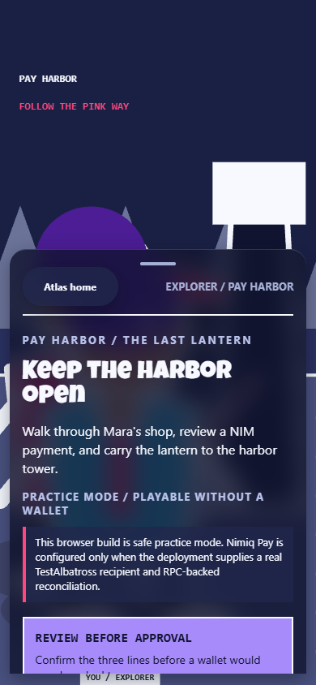
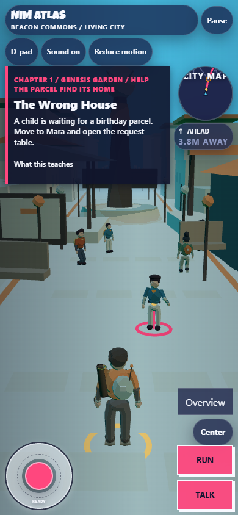
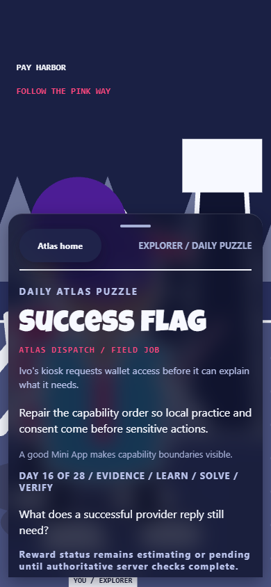
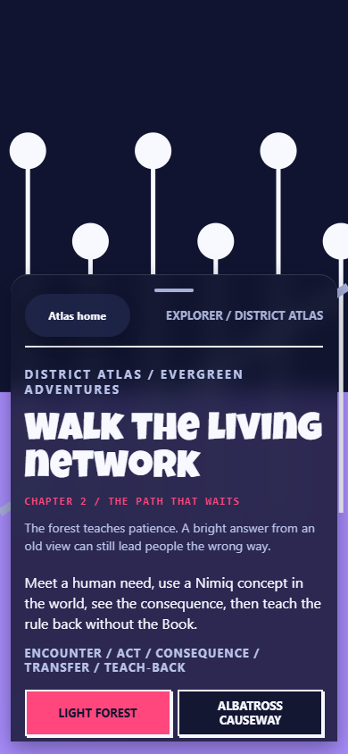
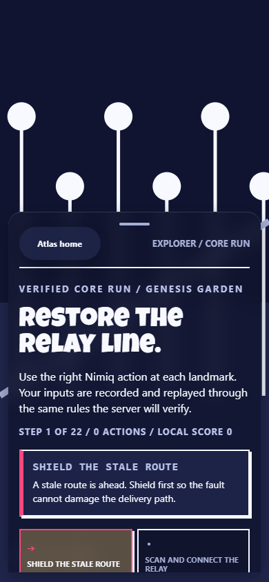

# sFace / NIM Atlas

Sface is a Nimiq Pay Mini App game. NIM Atlas is the game inside it. The player walks through a living city,
helps residents repair broken payment routes, and learns the Nimiq system by
making the right decision at the right place.

Play the current build at [sface.site](https://sface.site). The product is
free and playable without a wallet. Practice mode is the default.

Last reviewed: 2026-09-09.

## The player loop

Choose a role, enter Beacon Commons, follow the route marker, and use a Nimiq
idea to solve a problem. The city changes only after the required evidence is
present.

- Explorer follows Mara's Last Lantern route and learns how a payment moves
  from request to confirmation.
- Builder repairs the same route, predicts provider observations, and works
  through safe, allowlisted trials.
- Daily Atlas gives one date-based field puzzle. Completion is stored locally;
  reward eligibility is decided by the server when that feature is enabled.
- The Living Knowledge Book turns the five payment verbs into short teach-backs:
  Ask, Check, Approve, Confirm, and Unlock.
- The Verified Core Run is a deterministic 22-action replay that can be
  connected to wallet identity and server verification when competitive gates
  are enabled.

The game explains Lunas at the moment they matter. One NIM is 100,000 Lunas;
the practice lantern uses 10,000 Lunas, or 0.1 NIM. Practice mode never sends
that amount.

## What is in the build

| Surface | Current behavior |
| --- | --- |
| Beacon Commons | Full-screen procedural 3D city with player movement, camera orbit, route guidance, colliders, NPCs, LOD, city map, and local audio cues. |
| Pay Harbor | Mara's Last Lantern mission. Practice mode shows the exact request and local evidence path. A separately configured TestAlbatross path can request wallet approval, then waits for server confirmation. |
| District Atlas | A replayable curriculum route across Genesis Garden, Light Forest, Pay Harbor, Albatross Causeway, Validator Peaks, Builder City, and Beacon Core. |
| Daily Atlas | A date-selected field puzzle with local completion persistence and server-owned competitive eligibility. |
| Living Knowledge Book | Short explanations, examples, failure cases, and teach-back questions tied to the game loop. |
| Verified Core Run | A local deterministic run with an optional wallet-binding, ticket, replay submission, and verified result path. |

The 3D city is the current playable focus. Pay Harbor's mission logic and
payment review remain the authority boundary for Nimiq lessons. Not every
curriculum district has a separate production 3D scene yet.

## Architecture

The build has four boundaries:

```text
shared/atlas       deterministic rules, curriculum, replay, economy, types
        |           imported by both client and server
src/atlas          Vite client, input, renderers, audio, screens, wallet seam
        |           optional HTTP calls and Nimiq Pay provider calls
server/atlas       validated routes, tickets, replay grading, persistence,
                    chain lookup, leaderboard and reward gates
public/atlas       generated manifests and checked-in public art assets
```

The shared modules do not use the DOM, canvas, network, storage, or wall clock.
That lets the server rebuild a replay from the same definitions the client
used. `src/atlas/app/atlas-app.ts` owns screen transitions. The renderer reads
state but does not decide whether a payment or score is true. The server is the
authority for competitive results, reward status, and canonical payment
evidence.

The Nimiq provider is isolated behind `src/atlas/wallet.ts` and the payment
controller. Client callbacks and transaction lookups are evidence to inspect,
not proof on their own. A live payment can unlock the world only after the
server matches the network, recipient, integer Luna amount, success state, and
confirmation threshold.

See [the current state](docs/nim-atlas-current-state.md) and [the architecture
notes](docs/nim-atlas-architecture.md) for module ownership, failure states,
and the current capability boundary.

## Local development

```bash
npm install
npm run dev
```

The client works without a server and falls back to local practice content.
Copy `.env.example` to `.env` only when you need local service or TestAlbatross
configuration. `VITE_` values are public and must never contain secrets.

Run the release checks:

```bash
npm run check
npm run build
npm run verify:atlas:contrast
```

`verify:atlas:contrast` and `shoot:atlas` need a served build. In a second
terminal:

```bash
npm run build
npm run preview -- --host 127.0.0.1 --port 4173
npm run shoot:atlas
npm run verify:atlas:contrast
```

The screenshot command drives a real browser through
`scripts/shoot-atlas.mjs`. It captures the welcome, How to play, Pay Harbor,
payment review, Beacon Commons, Daily Atlas, District Atlas, and Core Run
surfaces at the checked mobile viewports. The images are evidence for review,
not hand-made mockups.

## Configuration boundaries

The safe defaults are all off:

- `ATLAS_TESTNET_ENABLED` and `VITE_ATLAS_TESTNET_ENABLED` enable the separate
  TestAlbatross payment path only when recipient, price, RPC URLs, and
  confirmation rules are present.
- `ATLAS_COMPETITIVE_ENABLED` enables server-issued competitive tickets only
  after the season, challenge, seed, and ruleset hashes are pinned.
- `ATLAS_REWARDS_ENABLED` stays off until the owner has approved the reward
  account, payout rules, reconciliation, and recovery runbook.
- `ATLAS_DURABLE_REPOSITORY_ENABLED` must be on before a deployment may present
  durable competitive or reward state.

The declared first-season allocation is 5,000,000,000 Lunas, or 50,000 NIM.
That is a planning allocation, not proof that funds are present or that a
player has earned a payout.

## Screenshots

The current generated set is kept in [docs/shots](docs/shots) and mirrored to
`public/atlas/screenshots` for review pages.












The capture recipe is the source of truth. Re-run `npm run shoot:atlas` after a
visual change instead of replacing an image by hand.

## Release and submission

Use [the current state report](docs/nim-atlas-current-state.md) for what has
been verified. Use [the deployment runbook](docs/deploy.md) for environment
boundaries and [the submission checklist](docs/submission.md) for the owner
actions that still require a real Nimiq Pay device, the competition portal, or
explicit treasury approval.

The repository keeps the former Cycle I market game and its plans for context.
Those files are marked historical. They are not the current product contract.

## License

MIT. See [LICENSE](LICENSE).
