<div align="center">

# sFace

**Crypto's down. Somebody has to save face.**

sFace is a crypto rescue game where the market and crypto Twitter create the
gameplay. Every day the worst-performing coin in the top 100 becomes the level.
Its real 24-hour price chart is the ground you fly over, the Fear and Greed index
sets the difficulty, and the people trapped in the wreck are the accounts crypto X
spent that day arguing about.

The level is generated from live market data at midnight UTC. Stage 1 to 7 is
never the same mission twice.

[Play](https://sface.site) · [What you are flying](#what-you-are-flying) · [The seven stages](docs/stage-1-to-7.md) · [How it is built](#how-it-is-built) · [Run it](#run-it)

</div>

---

<div align="center">
  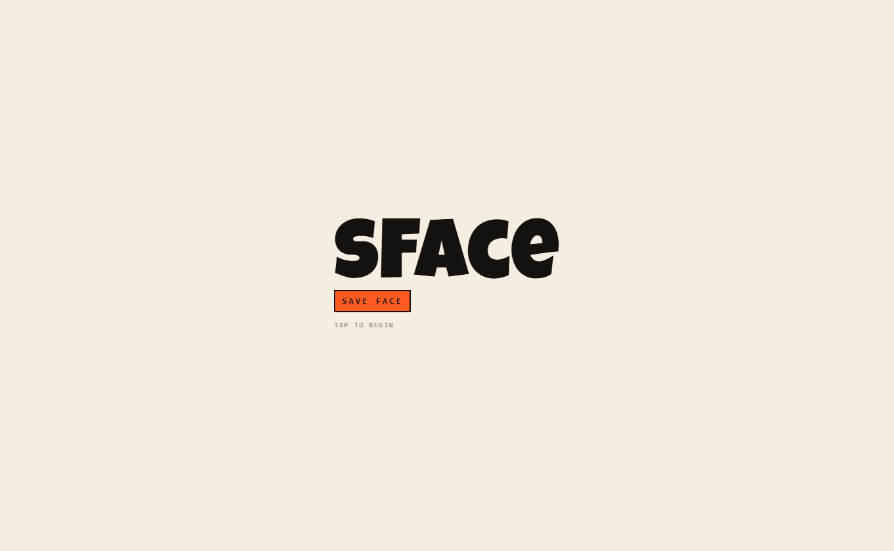
  <p><em>Every visit opens here. The tap starts the story and unlocks the voice.</em></p>
</div>

<div align="center">
  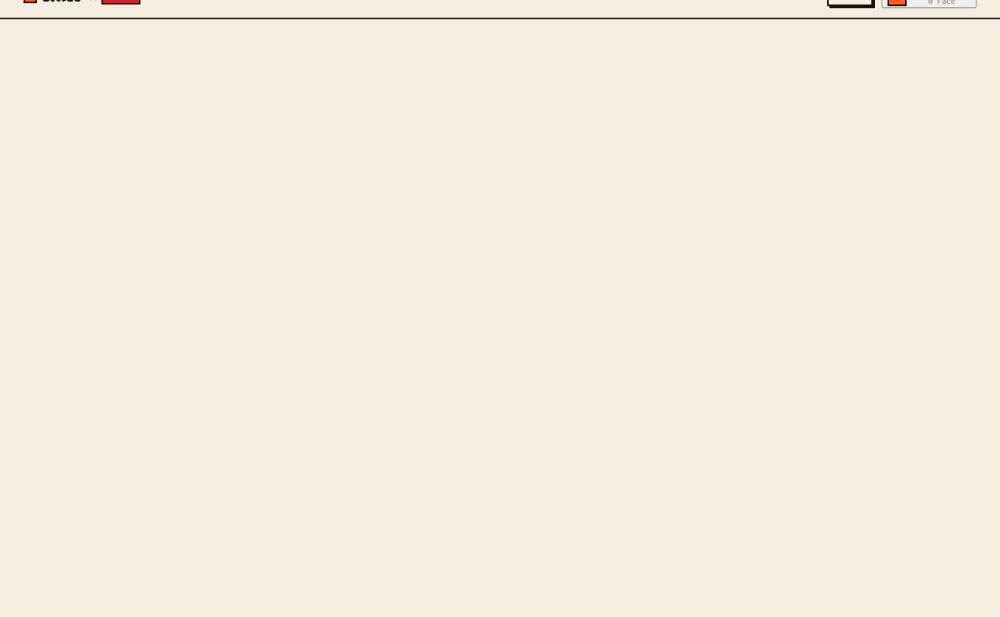
  <p><em>The home screen: today's coin, its move, and the ways in.</em></p>
</div>

## What you are flying

Three things in the game come from real data, and you can check all three from
inside a single run.

| | |
|---|---|
| **The map** | Today's worst performer in the top 100 becomes the stage. Its real 24-hour chart is the ground. A sharp drop is a wall you have to climb. A slow bleed is a long descent with nowhere to stand. |
| **The odds** | Fear and Greed sets how many attackers there are and how fast they fire. Everyone who plays that day gets the same difficulty. |
| **The cast** | The accounts trapped in the wreck are the ones crypto X spent the day discussing, read fresh each morning. Every post the game shows links back to the original. |

One rule holds the third one together: **no statement is ever attributed to a real
person without a link to the post it came from.** An early version generated
plausible quotes and it was removed. The model now returns indices into real posts
and never writes a URL.

<div align="center">
  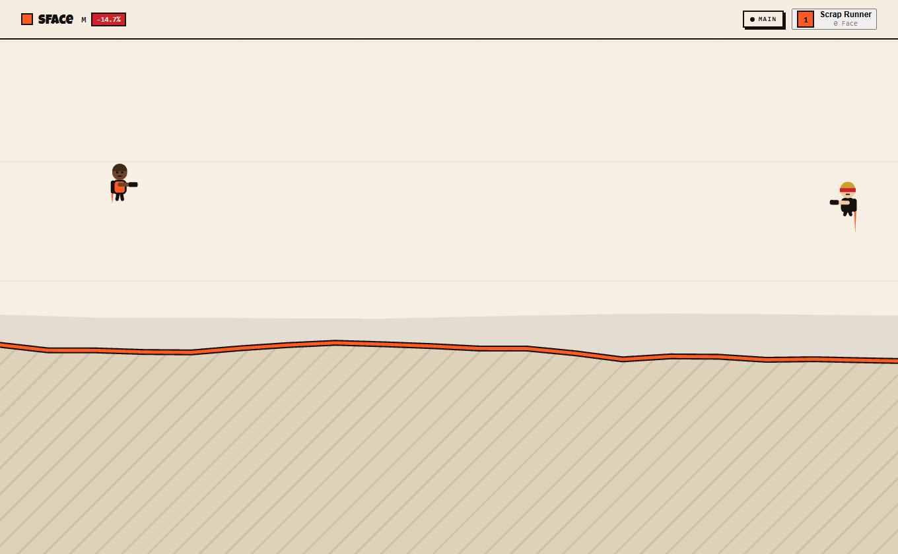
  <p><em>Stage one. That ridge is a real price move from the last 24 hours.</em></p>
</div>

## Seven stages, seven different games

Early testers said the stages felt like one run with a different background. Each
one now asks for something different.

| Stage | The world | What it asks |
|---|---|---|
| **1–3** | The chart | Fly it. Free people. Reach the pad before the clock runs out. |
| **4** | The chart, watched | Stay unseen. Guards have sight cones, and crossing one wakes the level. |
| **5** | A city | Drive or walk. The car is twice as fast and heard from twice as far. |
| **6** | A downtown | Read. Four posts that went out today, and one of them explains it. |
| **7** | A ring city | Work it out. No weapon opens a gate. |

**[The stages explained](docs/stage-1-to-7.md)** covers all seven: what each one is
for, what it asks, and the clock and crowding it runs at.

### Stages five and six: the city

Two stages leave the chart behind. A price line drawn as bars already looks like a
skyline, so the streets between the buildings are the gaps between the bars. Same
seed, same numbers, drawn differently. A volatile day gives a jagged city full of
cover. A flat day gives long open avenues with nowhere to hide.

<div align="center">
  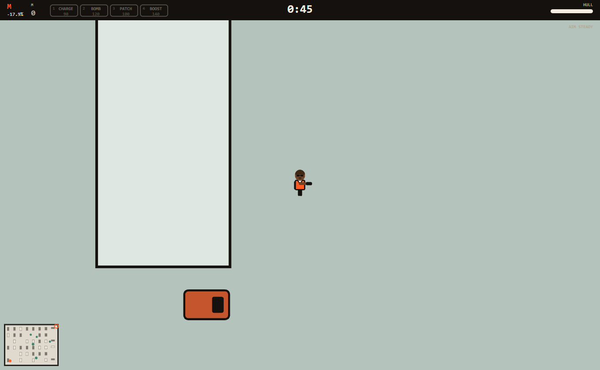
  <p><em>Streets built from the day's price bars. Some buildings open, and the doorway fits a person but not the car.</em></p>
</div>

### Stage seven: the ring city

The finale is a third kind of world. Concentric walls around a core, worked
inward, with one gap in each wall to find.

**No weapon opens a gate.** Reaching a project gives you its intel: where it ranks
by size, and how it is holding up today. The wall then asks a question about the
projects behind it and shows only their tickers, so you can only answer if you
went and looked. Fly past a project and you can still reach the wall. You just
cannot answer it.

<div align="center">
  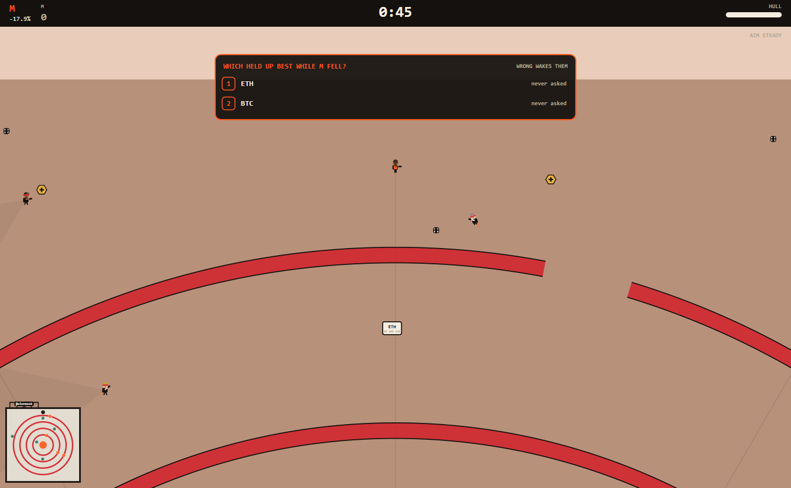
  <p><em>Both options marked <code>never asked</code>. The answer was out there and this player did not go and get it.</em></p>
</div>

The projects are the largest by market capitalisation on the day you play, from
the same market call that picks the day's wreck. Nobody curates the list.
Stablecoins are filtered out because a peg is designed not to move, so it has not
survived anything.

## The ending

Clearing the campaign pulls the camera back. The chart you spent seven stages
inside is redrawn smaller and smaller until the crash is a small notch on a long
climb.

<div align="center">
  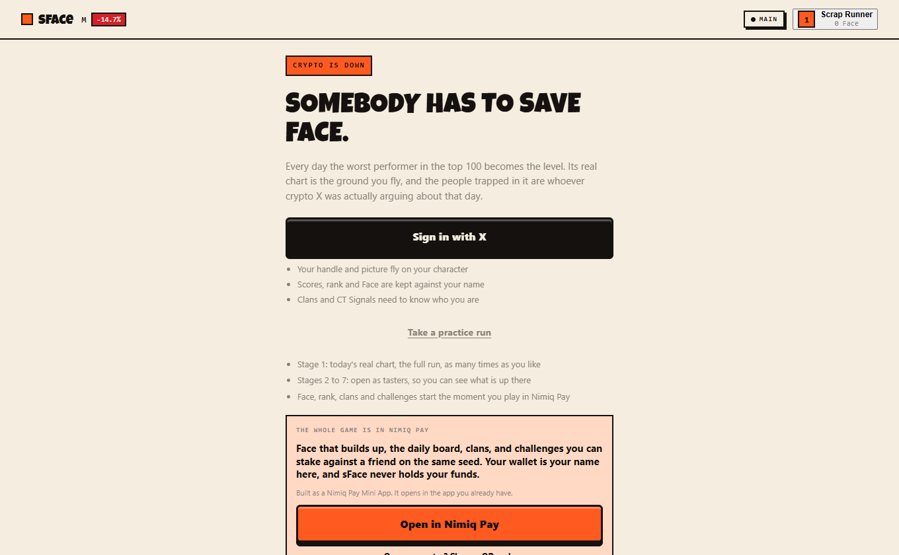
  <p><em>Every figure is fetched live. The closing line makes a claim about size, never a forecast.</em></p>
</div>

## Built for Nimiq Pay

sFace is a Mini App. It opens inside the wallet you already have, with your
identity and your clan already there. No download, no extension, no seed phrase in
the middle of a run.

- **Face is rank.** Every run earns it, and rank opens stages, weapons and a
  steadier gun. It adds up across days.
- **Challenges settle wallet to wallet.** Stake a friend on your exact seed and
  the better run takes it.
- **sFace never holds funds.** Stakes are ordinary transactions you sign in Nimiq
  Pay from your own wallet.
- **Scores are signed and re-checked.** Your wallet signs the score. The service
  rebuilds the level from the same seed and refuses a run that could not have
  happened.

Outside the wallet, every stage is a 25-second preview with the day's real chart
and real cast, and no score at the end.

<div align="center">
  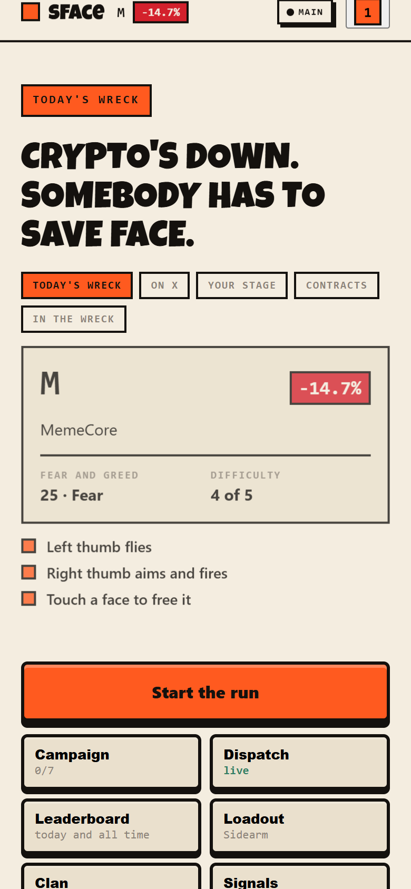
  &nbsp;&nbsp;
  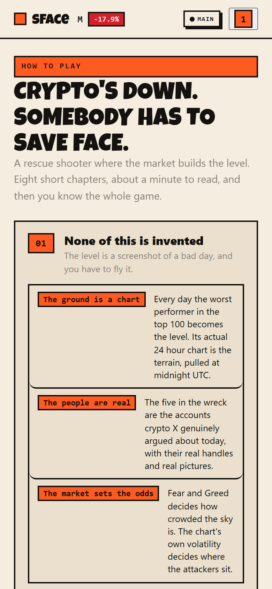
  <p><em>Built for phones. Both thumbs, and a guide written for a thumb.</em></p>
</div>

## Three ways to hold it, all of them live

Most games make you pick a control scheme and then punish you for picking wrong.
Here all three schemes listen on a phone at all times. The setting only decides
which one gets drawn.

<div align="center">
  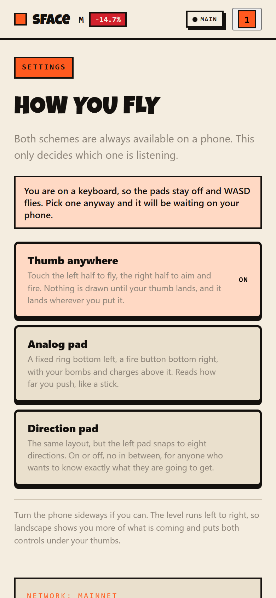
  <p><em>Pick one on a laptop and it is already waiting when you open the game on your phone.</em></p>
</div>

| | |
|---|---|
| **Thumb anywhere** | Nothing is drawn until your thumb lands, and then it appears wherever you put it. Left half flies, right half aims and fires. You never look down. |
| **Analog pad** | A fixed ring and a fire button, with bombs and charges on an arc above it. It reads how far you push, so a nudge is a nudge and a shove is full speed. |
| **Direction pad** | The same layout with the left pad snapped to eight directions. On or off, nothing in between. |

The ring leans the way your thumb goes and the fire button shows where the gun is
pointing, so you can always tell what the controls are doing. Turn the phone
sideways and you see more of the level, which runs left to right.

## MAIN and TEST

A chip in the top right shows which network you are on, because it changes what
every NIM figure on screen is worth. Mainnet is the default and always will be.

| | |
|---|---|
| **MAIN** | The whole game. Today's mission read live, real NIM, scores on the daily board, challenges that settle for real money, CT Signals reading live X. |
| **TEST** | The same game played for nothing, on data already in hand. NIM has no value, scores are verified but ranked on their own board, and anything that costs a paid API call is off. Settings links the Nimiq faucet. |

**Testnet never spends.** No X calls, no market calls, no model inference. A
testnet session gets whatever is already cached, and the built-in practice mission
if nothing is. It runs the same code and the same validation against real numbers,
so it is a real test. Every read of X is metered, and an afternoon of testing can
burn through a month of quota for information nobody needed.

That is also why the client is allowed to declare its own network. Declaring
testnet makes the service spend less and keeps a score off the real board. It
cannot unlock a feature, raise a limit, mint anything or move funds.

**You are the same player on both.** Connect X and your name, picture, clan and
friends follow you when you switch.

What does not follow is the scoring. The two boards are separate, and so are
lifetime Face and campaign progress. Testnet NIM comes from a faucet and a
rehearsal has nothing at stake, so pooling the totals would put free Face in a real
rank. Campaign progress also sets your aim assist tier, so if it were shared you
could grind the free chain to get an easier run on the paid one.

<div align="center">
  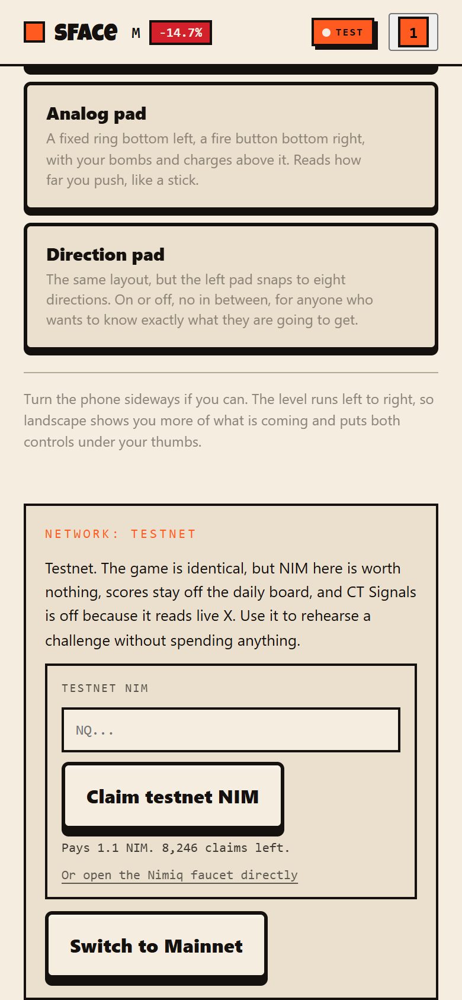
  <p><em>Every figure on that card is fetched live. Refresh it twice and the claim count has moved.</em></p>
</div>

**Getting testnet NIM takes one tap.** Testnet is where you try a staked challenge
before there is money on it, so nobody should have to go hunting for a faucet. The
claim happens in the app: paste an address, or let it fill in from your wallet.

The card shows what the faucet has left as well as what it pays, because a dry
faucet and a refused address are different problems and you should be able to tell
which one you have. The faucet's own page is linked underneath, so if this
shortcut breaks you can still go to the source.

## How it is built

**Client.** TypeScript, Vite, canvas 2D. No game engine and no framework. Every
character on screen is drawn by one function.

**Service.** Node, Express, zod at every boundary. It builds the day's mission from
CoinGecko and Fear and Greed, reads crypto X for the story, and verifies scores.

**Chain.** Nimiq Pay Mini App SDK. Ed25519 signatures over the Nimiq
signed-message envelope, verified on the server with `@nimiq/core`.

### Rules the code holds itself to

<details>
<summary><strong>Two random streams, kept separate on purpose</strong></summary>

<br>

`levelRng` runs once at construction and lays out the whole level. `runRng` handles
everything reactive during play. If enemy fire timing drew from `levelRng`, one
player killing an enemy early would shift every later draw, and two players on the
same seed would stop playing the same level. That bug stays invisible until a
staked challenge settles wrong.
</details>

<details>
<summary><strong>Scores are checked by rebuilding the level</strong></summary>

<br>

The service rebuilds the run from the seed using the client's own parser, so it
checks against the exact level the client was given. A claim of more kills than the
level contains is refused. The signing address is derived from the public key, and
there is no address field in the request.
</details>

<details>
<summary><strong>A staked challenge is levelled</strong></summary>

<br>

Aim assist starts at a baseline for everyone and rises with progress, but a
challenge pins both sides to the baseline. The camera also refuses to show a
desktop more of the level than a phone. A bet should settle on who played better
today, not on who has been playing longer.
</details>

<details>
<summary><strong>Nothing can be bought</strong></summary>

<br>

Scrip is earned during a run and cannot be purchased. Pay-to-win would break the
fair-bet guarantee the whole challenge system depends on.
</details>

<details>
<summary><strong>Testnet never spends</strong></summary>

<br>

A testnet session serves cached reads and makes no metered call: not X, not the
market, not model inference. Its scores are verified and ranked on their own board.
Declaring testnet can only make the service spend less, so trusting the client with
it is safe.
</details>

## What we hit building on Nimiq Pay

[**docs/feedback.md**](docs/feedback.md) has the full list with the exact SDK
surface behind each one.

The short version: the provider's `WALLET_METHODS` is a closed set of ten methods
and none of them creates a contract. Nimiq supports HTLCs natively, so the protocol
is not the blocker, but a Mini App cannot get a contract-creation transaction
signed, and `request()` sends anything unlisted to a node that holds no keys.

That decides how staking works here. Nothing is held in escrow. A contest records
who owes what, the loser pays in one tap, and the payment is published next to the
debt so the winner can check it. The app records the debt and cannot collect it,
and the screen says so. Free contests are the default, because a contest with
nothing on it cannot be defaulted on.

The rest of the list is workarounds: no balance method, so the profile reads one
over JSON-RPC; no official Proof-of-Stake explorer, so board rows link to a
community one; a faucet page that renders blank, so the claim happens in our own
settings screen.

## Repository

```
src/
  core/       loop, input, pads, network, audio, speech
  game/       the simulation. no DOM, no canvas, no fetch
    terrain     the chart, as ground
    city        stages 5 and 6: blocks and streets
    rings       stage 7: concentric walls and a core
    node        stage 6: reading the day's posts
    ally        stage 7: intel, and the gates it opens
    assist      aim help, and why a staked run is levelled
  render/     canvas only. reads state, never writes it
  ui/         DOM screens
  net/        anything that talks to the service
server/
  oracle      builds the day from CoinGecko and Fear and Greed
  xsense      reads crypto X for the story and the cast
  verify      rebuilds a level to check a submitted score
  attest      Nimiq signature verification
  contests    stakes, entrants, standings and settlement
scripts/
  shoot.mjs   regenerates every screenshot in this file
```

## Run it

```bash
npm install
npm run dev          # client on 5173
npm run server:dev   # service on 8790
```

The client works with no service at all. It falls back to a practice mission and
every stage is playable. The service is what makes it today's real market.

```bash
npm run check            # three tsconfigs and the whole suite
npm test                 # 652 tests
npm run prove            # run the two honesty claims and print what they return
node scripts/shoot.mjs   # re-shoot the screenshots above
```

`npm run prove` takes about thirty seconds. It calls the same `levelFacts`,
`refuse` and `verifyClaim` the service calls, prints each seed's real ceiling,
then signs a claim with a real Ed25519 keypair and tries to tamper with it six
different ways. Every refusal is printed with its reason.

Copy `.env.example` to `.env`. Every key is optional, and a missing one turns off
a feature rather than breaking the app.

## Deploy

The client is static and builds to `dist`. The service ships as a container. CI
runs the suite, publishes to GHCR, and rolls out to the VPS, where the deploy key
is pinned to a single root-owned script that accepts nothing but a commit sha.

Screenshots are generated, not taken by hand. `node scripts/shoot.mjs` drives a
real browser against the dev server and puts the game into each state, so the
images cannot drift from the build they sit beside.

---

<div align="center">
  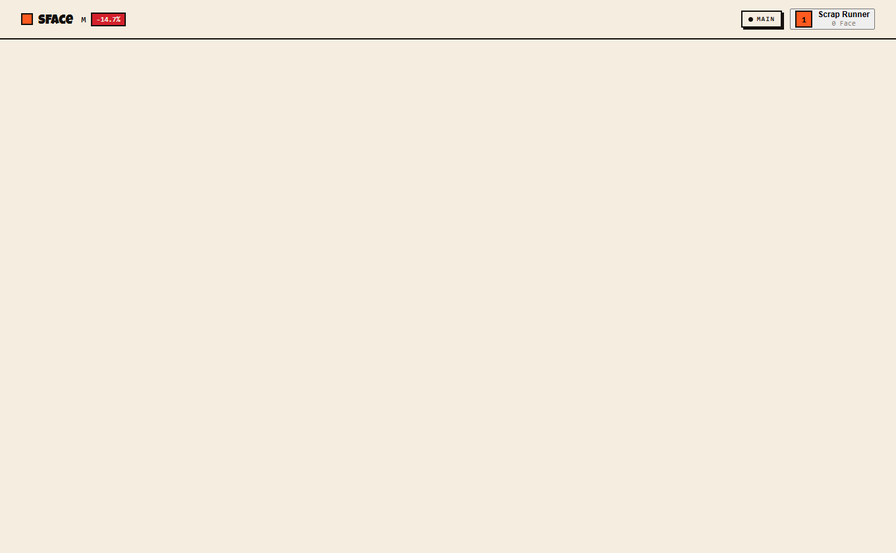
  <p><em>The same explanation ships inside the app, reachable from the footer on every screen.</em></p>
</div>

<div align="center">
  <sub><strong>The market builds the level.</strong></sub>
</div>
